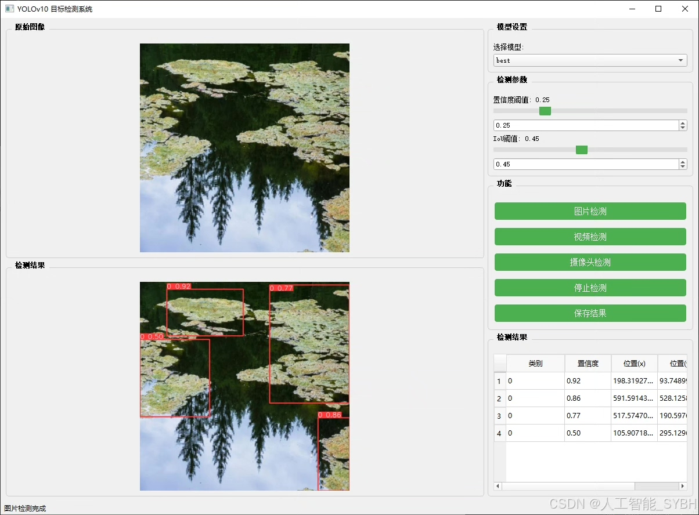
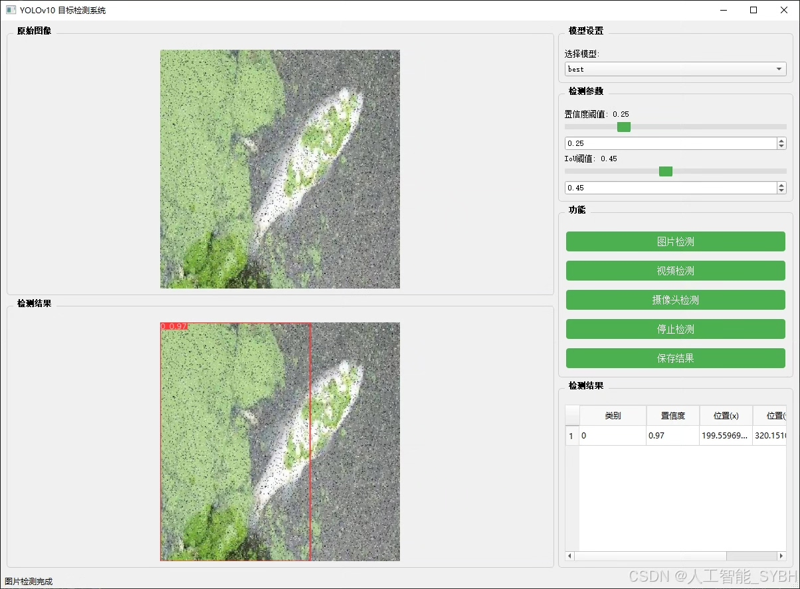
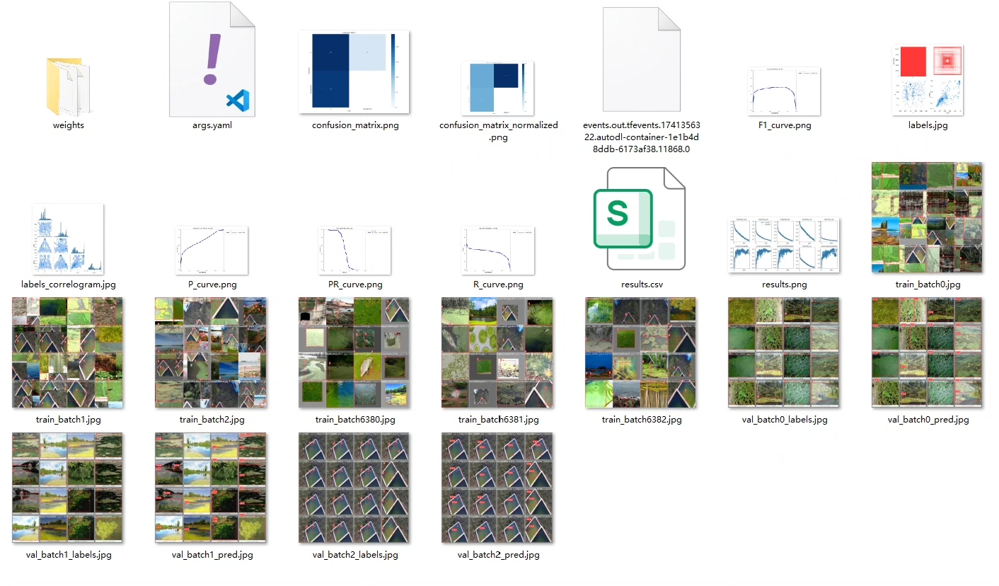
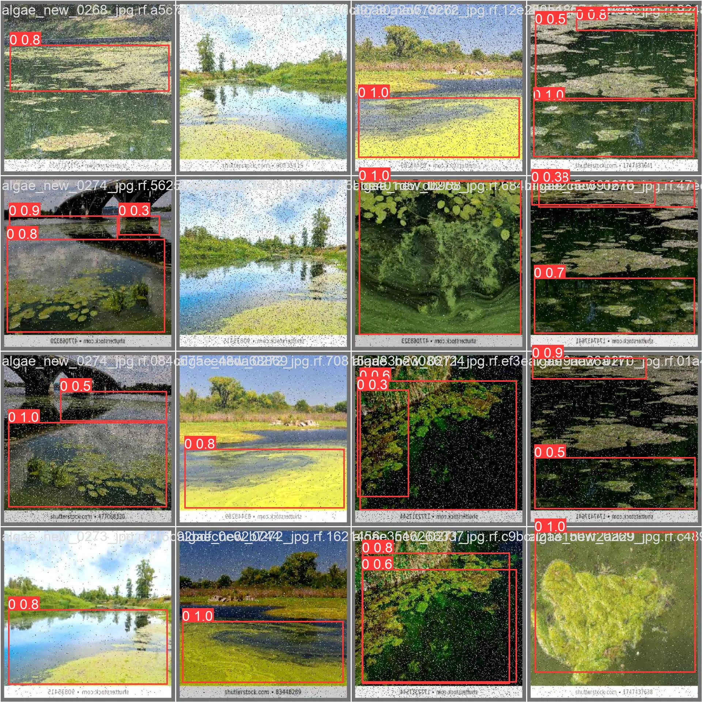
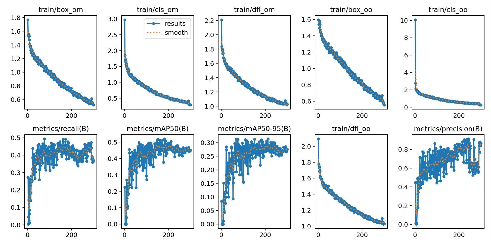
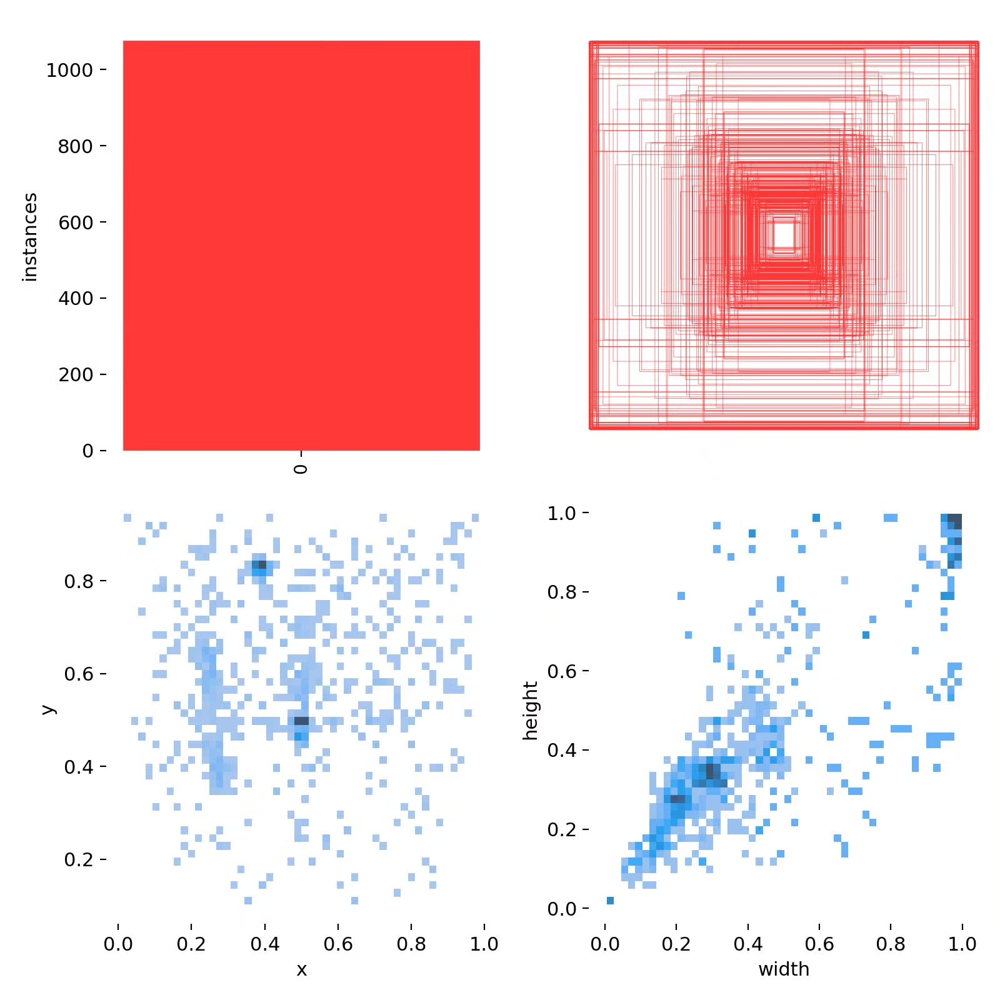
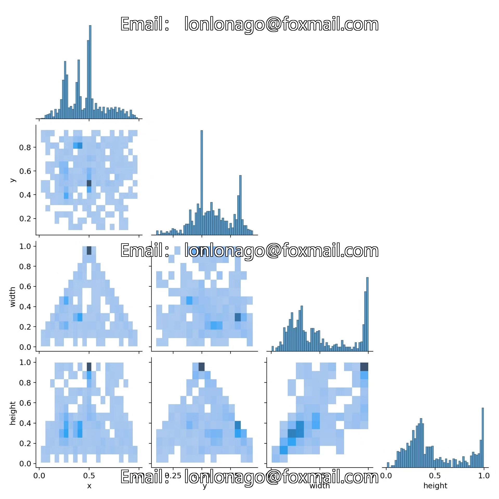
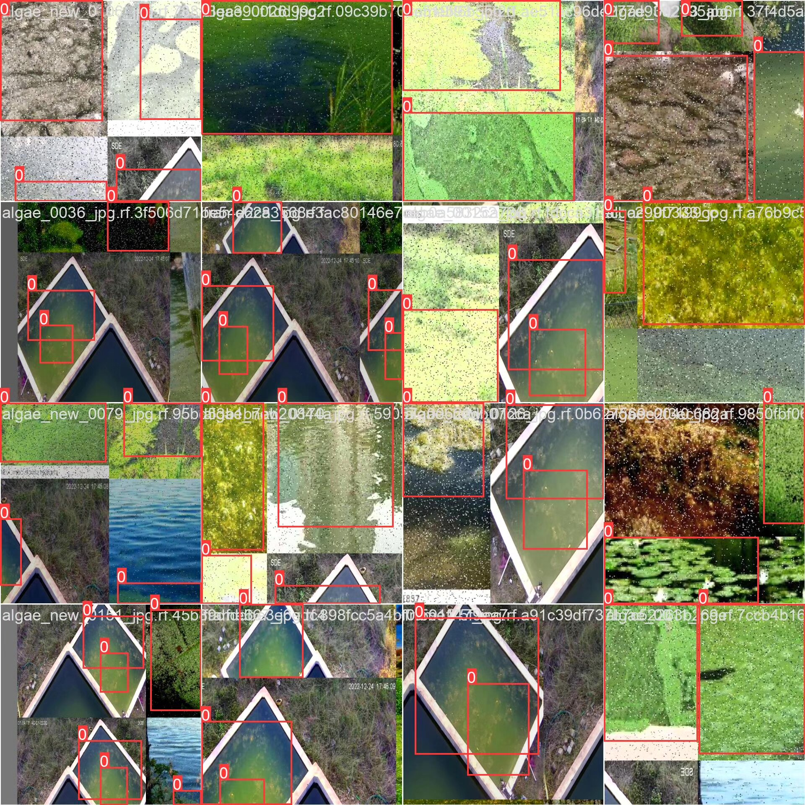

# YOLOv10-based water algae detection system based on deep learning (YOLOv10+Y)

## Body

Based on deep learning YOLOv10, a water alga detection system (YOLOv10+YOLO dataset + UI interface + Python project source code + model)

Deep learning target detection technology (such as YOLO series) has shown great potential in the field of environmental monitoring. YOLOv10, as the latest version, has higher detection accuracy and real-time performance, which is very suitable for the scene of water alga detection. The purpose of this project is to use the YOLOv10 algorithm, combined with underwater image data, to develop a set of intelligent water alga detection systems, providing technical support for water quality management and ecological protection.

The company's products have obtained the official commercial license certification of YOLO.

Package after-sales service: After payment, we will provide WeChat ID, answer questions anytime.

Environment configuration: A tutorial on environment configuration will be provided, and WeChat will provide answers.

Remote installation service: If you need remote configuration, an additional fee of 69 is required,
If the configuration fails, all fees will be refunded (specially for old computers only refund installation fees).

Retraining dataset: After configuring the environment, training can be done on your own computer.
If you need us to train it, just pay 69 + computing power fees (2.5 yuan/hour)

Full package after-sales service

## Images

## Payment

Here is a pay link on Stripe ( https://buy.stripe.com/3cs8yP7sY87d0vu9AB ). Please contact me lonlonago@foxmail.com after funding $89, and I will send you a complete data files , thank you!

